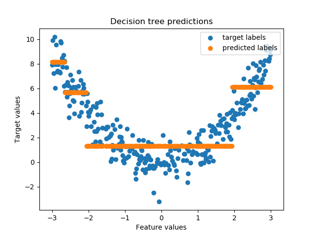
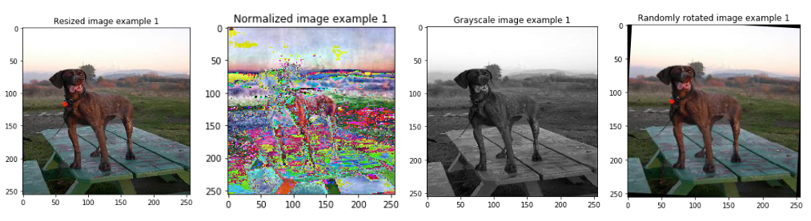

# Основи машинного навчання

Цей репозиторій містить реалізації базових алгоритмів машинного навчання на Python (версія Python 3.6+). Всі алгоритми реалізовані з нуля без використання додаткових бібліотек машинного навчання. Метою цих блокнотів є базове розуміння алгоритмів та їх базової структури, а **Не** забезпечення найбільш ефективних реалізацій. 

- [Лінійна регресія](linear_regression.ipynb)
- [Логістична регресія](logistic_regression.ipynb)
- [Перцептрон](perceptron.ipynb)
- [k-найближчих сусідів](k_nearest_neighbour.ipynb)
- [Кластеризація методом к–середніх](kmeans.ipynb)
- [Проста нейронна мережа з одним прихованим шаром ](simple_neural_net.ipynb)
- [Поліноміальна логістична регресія](softmax_regression.ipynb)
- [Дерево рішень для класифікації](decision_tree_classification.ipynb)
- [Дерево рішень для регресії](decision_tree_regression.ipynb)
  
  

## Попередня обробка даних 
 

- [Попередня обробка зображень](image_preprocessing.ipynb)
- [Попередня обробка числового / категоріального набору даних ](data_preprocessing.ipynb)

## Зворотній зв'язок 

Якщо Ви виявили помилку/помилки в одному із блокнотів, дайте мені знати, створивши нове issue. 

## Джерело

[Machine learning basics](https://github.com/zotroneneis/machine_learning_basics)
